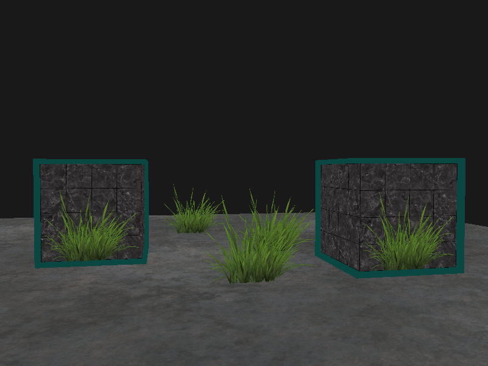
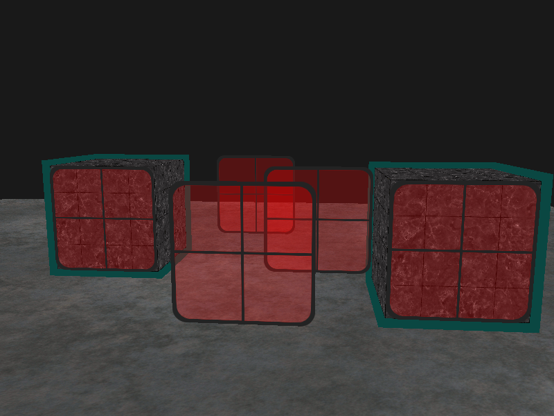

# learnOpenGL

## Usage

Currently only "officially" supports Windows - Mac and Linux support is coming soon.

```
git clone --recursive https://github.com/jingangxin36/learnOpenGL
```

Run `Win-Premake.bat` and open `Graphyics.sln` in Visual Studio 2017. 

### Tag_1_1: 创建一个窗口


### Tag_1_2: 画一个一个五彩斑斓的绿色三角形


### Tag_1_2: 移动的相机看箱子


### Tag_2_1: 真实的钢制边框箱子


### Tag_2_2: 聚光灯


### Tag: 加载模型(忘记截图了)

### Tag_3_1: 模板测试


### Tag_3_2: 透明丢弃



### Tag_3_3: 透明混合且排序


